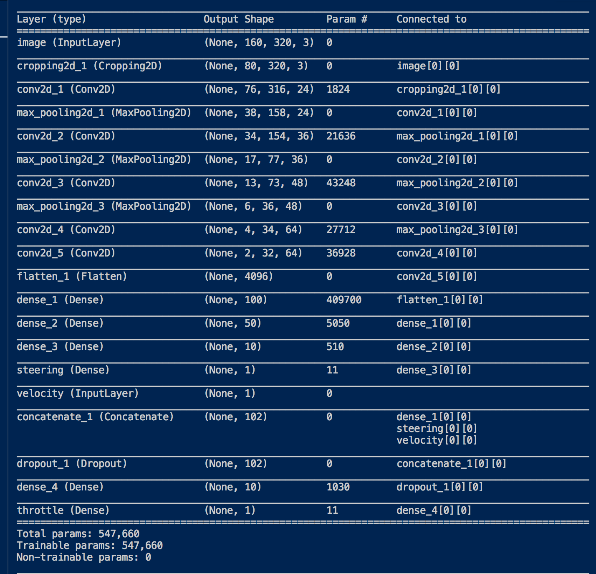

# **Behavioral Cloning** 
---

**Behavioral Cloning Project**

The goals / steps of this project are the following:
* Use the simulator to collect data of good driving behavior
* Build, a convolution neural network in Keras that predicts steering angles from images
* Train and validate the model with a training and validation set
* Test that the model successfully drives around track one without leaving the road
* Summarize the results with a written report

#### 1. Submission includes all required files and can be used to run the simulator in autonomous mode

My project includes the following files:
* model.py containing the script to create and train the model
* drive.py for driving the car in autonomous mode
* model.h5 containing a trained convolution neural network 
* writeup_report.md or writeup_report.pdf summarizing the results
* base_itterator.py containing class for creating itterator 
* list_itterator.py contain extension of base itterator for getting the images and preprocess them and yield batch
* image.py contain function for preprocessing the image 

Note: The Idea for itterator is taken from Keras but as they have itterator from directory but that itterator did not give me solution of the output as i have the image and speed as input to the network so i rework to fit my issue. 

#### 2. Submission includes functional code

If you run the -.h5 through the simulator the output will be like model.mp4 ( i used Udacity Working Enviorment) as i didnt install the simolatar locally. 

I make changes in the drive.py to fit my input as instead what there was only as input image i have plus velocity so there is change so please use drive.py provided here. Runing the script as is provided by Udacity

```sh
python drive.py model.h5
```

#### 3. Submission code is usable and readable

I have separated the architecture and training phase in two files :
* model.py - the architecture used
* train.py - whole pipeline from loading the images, using the itterator and saving the variables from the training model


### Model Architecture and Training Strategy

#### 1. An appropriate model architecture has been employed

The model goes in depth from 3 to 64 , using RELU for nonlinearity. As

#### 2. Attempts to reduce overfitting in the model

The only thing for protecting from overfitting was fliping and rotating the images and also shuffiling eeach batch so in each epoch we have different batch.  

#### 3. Model parameter tuning

For training the model i used Adam Optimizer and mse loss. Also i used callbacks from Keras where i defined:saving only the best epochs trained variables and also EarlyStopping which monitored validation loss patience of 5. I setup also LearningRateScheduler:
* LEARNING_RATE =1e-3
* DECAY = .5
* PATIENCE = 5
* BATCH_SIZE = 8
* MODEL_NAME = 'get_nvidia'


#### 4. Appropriate training data

Explained in below section for `Creation of the Training Set & Training Process` 

### Model Architecture and Training Strategy

#### 1. Solution Design Approach

The First Step in Design the whole pipeline was spliting whole dataset for training and validation for which the `from sklearn.model_selection import train_test_split` was used . I keep only 0.2 for validation. 

The first steps in building the pipeline for training the network (as i started on my mac without GPU) for me was how to set up effective pipeline which will not spend to much time for reading whole batch of the images convert them , apply data augmentation and feed to the model. 

I used `multiprocessing.pool.Threading` which on my CPU decrease the time for 50% and also on GPU ( from Udacity Workspace) for processing of around 6000 images + 1600 images training and validation took  43s as all the workers convert whole batch from .png to array and after that i use map function to get back from the pool.

So all of the reading pipeline is implemented in list_itterator.py where also data is shuffled when we create the batch. So on each epoch we have different batches. 

```python
def _get_batches_of_transformed_samples(self, index_array) :
        batch_image_center = np.zeros((len(index_array),) + self.target_size,dtype=self.dtype)
        batch_speed = np.zeros((len(index_array),),dtype=self.dtype)
        batch_throttle = np.zeros((len(index_array),),dtype=self.dtype)
        batch_steering = np.zeros((len(index_array),),dtype=self.dtype)
        #############Implemeented MULTIPROCESSING#########
        pool = multiprocessing.pool.ThreadPool(self.batch_size)
        all_images = [pool.apply_async(self.read_img, ('data/'+self.data[0][j],)) for i, j in enumerate(index_array)]
        for i,b in enumerate(all_images):
            batch_image_center[i] = b.get()
        for i, j in enumerate(index_array):
            batch_speed[i] = round(self.data[1][j],2)
            batch_throttle[i] = round(self.data[2][j],2)
            batch_steering[i] = round(self.data[3][j],2)
        pool.close()
        pool.join()
        return [batch_image_center, batch_speed], [batch_steering, batch_throttle]
```

So having the batch prepared to be feed to the network i choose the Nvidia Architecture. ( presented in the next point 2. Final Model Architecture)

At the end of the process, the vehicle is able to drive autonomously around the track without leaving the road.

#### 2. Final Model Architecture

The final model architecture model.py consisted of a convolution neural network with the following layers and layer sizes:



#### 3. Creation of the Training Set & Training Process

explained above
